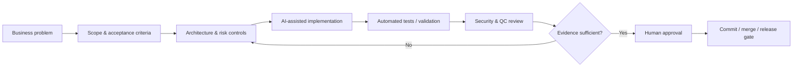

# JCB — AI-Assisted Full-Stack & Automation Portfolio

**UAE-based builder focused on AI-assisted software delivery, workflow digitization, full-stack systems, automation, data quality, and controlled technical execution.**

This repository is a recruiter-facing portfolio for **JCB**. It presents selected project architecture, engineering decisions, validation evidence, and safe demonstration code while intentionally excluding private production repositories, customer data, credentials, secrets, and proprietary implementation details.

> **Working principle:** AI accelerates implementation. Architecture, deterministic controls, automated verification, security checks, and human approval govern what gets accepted and released.

## Featured Work

| Project | Problem solved | Engineering focus | Portfolio status |
|---|---|---|---|
| [Luxorium / JCB Control Plane](projects/luxorium-control-plane.md) | Multi-company activation, licensing, access control and security | TypeScript, NestJS, PostgreSQL, WebAuthn/passkeys, sessions, Playwright | Active development; validated frontend/API/database foundations |
| [TAG Armored Vehicle QC](projects/armored-vehicle-qc.md) | Replace paper-heavy vehicle inspection with an auditable offline-first workflow | Kotlin, Jetpack Compose, encrypted local storage design, NestJS, PostgreSQL, CameraX | Milestone-gated; mobile/security/backend foundations validated |
| [UAE Real Estate Analytics](projects/real-estate-analytics.md) | Evidence-backed property and investment analysis | Python, Dash, SQLite, QC pipelines, XLSX/PDF reporting | Analyst workflow, calculations and exports validated locally |
| [AI-HQ](projects/ai-hq.md) | Governed AI-assisted engineering and reusable development controls | GitHub Actions, Docker, CI runners, Python/TypeScript tooling, agent/tool integration | Active R&D/development infrastructure |

## What I Can Demonstrate

- Full-stack system decomposition: frontend → API → database → authentication → audit/control layers
- REST API and backend-service concepts using Node.js/TypeScript/NestJS
- PostgreSQL and SQLite data modelling, migrations, persistence and evidence lineage
- Authentication and authorization concepts: passkeys, MFA, sessions, role boundaries and high-risk action controls
- Browser/system validation with Playwright-style automated testing
- Python analytics, data normalization, duplicate detection, QC and report generation
- Offline-first mobile workflow design with evidence capture and approval/rework states
- Docker/local development, Git/GitHub workflows and CI validation
- DNS/domain/server troubleshooting concepts and deployment preparation
- AI-assisted implementation with explicit scope, acceptance criteria, tests and human review

## Engineering Workflow

## Recruiter Review Path

1. Read the [Recruiter Guide](RECRUITER_GUIDE.md) for a 5-minute review path.
2. Review the [Skills & Evidence Matrix](SKILLS_EVIDENCE_MATRIX.md) for what is demonstrated vs. still developing.
3. Open the four project case studies in [`projects/`](projects/).
4. Open [`architecture/`](architecture/) for GitHub-rendered system diagrams.
5. Review [`code-samples/`](code-samples/) for safe, synthetic implementation examples.
6. Review [`screenshots/`](screenshots/) and [`demos/`](demos/) for evidence capture guidance.

## Integrity / Claim Boundaries

This portfolio intentionally distinguishes between **demonstrated**, **designed**, and **still developing** capabilities. I do not claim production experience with a tool solely because AI can generate code for it. Where a technology is not yet demonstrated by working project evidence, I label it accordingly.

That matters to how I work: generated output is treated as a draft until it is tested, reviewed, and accepted against defined requirements.

## Security & IP Boundary

This portfolio excludes:

- API keys, access tokens, passwords, `.env` values and private credentials
- customer/employer confidential information and production databases
- private infrastructure details that create unnecessary security exposure
- complete proprietary source repositories
- any code or content I do not have the right to publish

See [SECURITY.md](SECURITY.md) and [NOTICE.md](NOTICE.md).

## Availability

Open to implementation-focused AI/full-stack/automation opportunities in the UAE where practical delivery, structured troubleshooting, rapid learning, and evidence-backed execution matter more than formal credentials alone.

---

**Portfolio note:** This repository is for evaluation and demonstration. Unless a file explicitly states otherwise, no license is granted to copy, redistribute, commercialize, or reuse proprietary project designs or underlying private systems.
