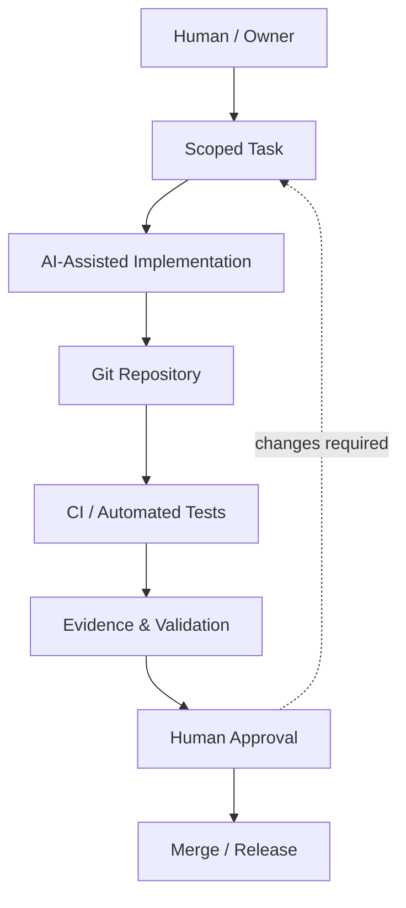

# AI-HQ — Portfolio Architecture

```mermaid
flowchart TB
    Human[Human / Owner]
    Scope[Scoped Task]
    AI[AI-Assisted Implementation]
    Repo[Git Repository]
    CI[CI / Automated Tests]
    Evidence[Evidence & Validation]
    Approval[Human Approval]
    Release[Merge / Release]

    Human --> Scope
    Scope --> AI
    AI --> Repo
    Repo --> CI
    CI --> Evidence
    Evidence --> Approval
    Approval --> Release
    Approval -. changes required .-> Scope
```

## Design Principle

AI accelerates implementation; deterministic controls, automated verification, and human approval govern progression.
