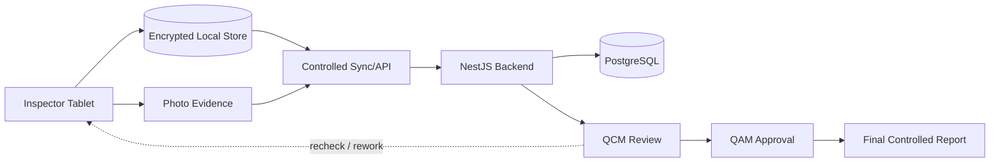

# TAG Armored Vehicle QC — Portfolio Architecture

## Design Principle

The tablet remains useful offline; synchronization, approvals, and final records are controlled rather than assumed to be continuously connected.
