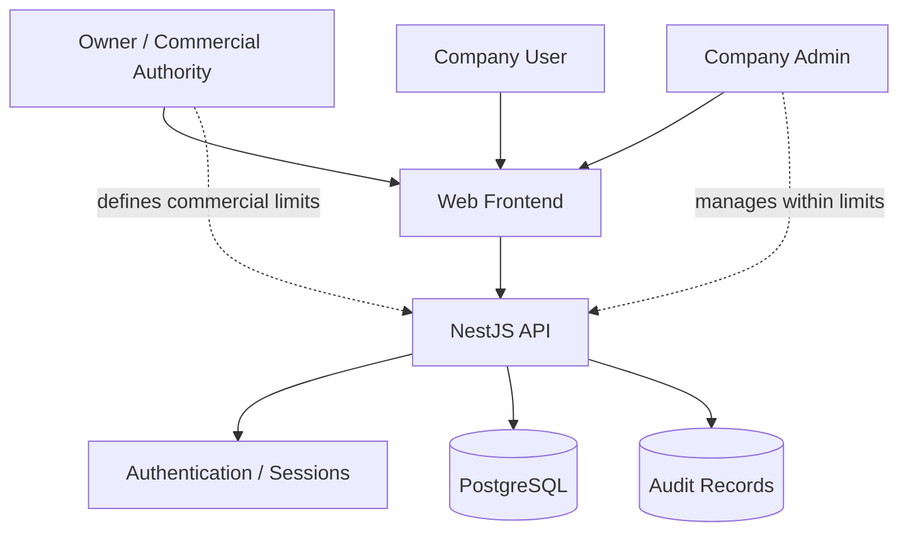

# Luxorium / JCB Control Plane — Portfolio Architecture

## Boundary Principle

Company administrators may manage their tenant within owner-defined limits; they do not receive authority to increase commercial entitlements.
