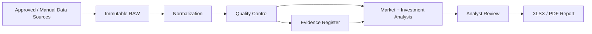

# UAE Real Estate Analytics — Portfolio Architecture

## Design Principle

No unverified datapoint should silently become a decision-grade fact. Evidence lineage and analyst review remain part of the workflow.
