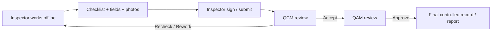

# TAG Armored Vehicle QC

## Executive Summary

TAG Armored Vehicle QC is a private, offline-first Android quality-control system designed to digitize a complex armored-vehicle inspection workflow. It replaces paper-heavy inspection handling with structured checklists, evidence capture, signatures, recheck/rework loops and controlled approvals across **Inspector → QCM → QAM**.

## Business Problem

The source process contains a large inspection surface with staged vehicle progression, PDI/FIR checklists, fields, photo evidence and review states. Paper-based execution can create:

- missing evidence,
- inconsistent checklist completion,
- weak rework traceability,
- manual photo handling,
- difficult revision history,
- slow final-report preparation.

## My Role

- Product owner and workflow designer
- Converted real inspection/PDI/FIR material into structured requirements
- Defined roles, state transitions, evidence capture, signing and recheck behavior
- Directed milestone-gated implementation and validation
- Required offline-first operation, encrypted storage direction and backend-enforced authorization

## Workflow

## Architecture / Technologies

- Kotlin / Jetpack Compose
- Android tablet, landscape-first interaction
- Room + encrypted local-storage direction
- SQLCipher-oriented storage design
- CameraX evidence capture
- NestJS backend
- PostgreSQL
- Docker/private deployment direction

Architecture: [`../architecture/armored-vehicle-qc.md`](../architecture/armored-vehicle-qc.md)

## Security / Record Design

Requirements include:

- encrypted local storage,
- immutable signed revision concepts,
- audit history,
- trusted-device controls,
- OTP/authentication controls,
- private synchronization,
- backend-enforced authorization,
- controlled final PDF/report generation.

## Validation Evidence Recorded During Development

Selected milestone evidence has included:

- clean Android builds and debug APK generation,
- Pixel Tablet / Android API 34 emulator testing,
- backend database migrations and automated tests,
- Android unit/lint/debug validation,
- Room instrumentation build validation,
- authentication/trusted-device hardening work.

The project remains milestone-gated. Later company-pilot and hardened-production capabilities are **not** represented as complete until their gates are passed.

## What I Would Demonstrate Live

1. Inspector dashboard and unit status.
2. Structured checklist execution.
3. Evidence/photo capture flow using synthetic test content.
4. Sign/submit transition.
5. QCM recheck/rework loop.
6. Explain offline persistence and controlled synchronization.

## What This Demonstrates

- complex workflow digitization,
- mobile/offline-first architecture,
- structured state machines,
- role-based approvals,
- evidence/photo workflows,
- security-conscious local persistence,
- backend/API integration planning,
- audit/revision thinking,
- milestone-based technical validation.

## Portfolio Evidence To Add

- `screenshots/tag-qc-01-inspector-dashboard.png`
- `screenshots/tag-qc-02-unit-workflow.png`
- `screenshots/tag-qc-03-checklist.png`
- `screenshots/tag-qc-04-photo-evidence.png`
- `screenshots/tag-qc-05-review-state.png`
