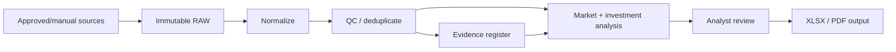

# UAE Real Estate Analytics Platform

## Executive Summary

This project is an analyst-oriented UAE real-estate decision platform. Its governing principle is: **AI is not the source of truth**. Data must be sourced, preserved, normalized, quality-checked and traceable before it supports an investment conclusion.

## Business Problem

Property analysis combines transactions, listings, rent expectations, fees, financing assumptions and comparables. When these inputs are mixed without evidence lineage, automation can produce confident but unreliable outputs.

The platform structures that work into a controlled analytical workflow.

## My Role

- Product owner and analyst-workflow designer
- Defined evidence/QC rules and approval-state logic
- Directed dashboard, calculation and export implementation
- Tested scenarios and regression behavior
- Required unverified external data to remain disabled rather than silently displayed as fact

## Analytical Pipeline

## Capabilities

- controlled data imports,
- raw-data preservation concepts,
- normalization and duplicate detection,
- evidence registers,
- comparable-property analysis,
- trend views,
- cash/mortgage scenarios,
- case history and approval states,
- XLSX and PDF exports,
- regression/scenario testing.

## Selected Metrics

The analytical model includes work around:

- gross rental yield,
- NOI,
- DSCR,
- cash-flow scenarios,
- off-plan paid capital vs. remaining liability,
- comparable AED/sq ft analysis,
- investment-return comparisons.

## Technology

- Python
- Dash analytical UI
- SQLite case history
- structured normalization/QC pipeline
- XLSX export
- PDF report generation

Architecture: [`../architecture/real-estate-analytics.md`](../architecture/real-estate-analytics.md)

## Governance Boundary

The broader decision package separates:

1. Market Analysis
2. Investment Analysis
3. Certified Valuation
4. Legal Due Diligence

The software assists analysis; it does not claim to replace licensed valuation or legal review.

## What I Would Demonstrate Live

1. Input/import path.
2. QC and evidence handling.
3. Comparable analysis.
4. Investment calculations.
5. Case history/approval concepts.
6. XLSX/PDF output.

## What This Demonstrates

- Python analytics,
- data engineering/QC thinking,
- evidence lineage,
- deterministic calculations,
- analytical dashboard iteration,
- report generation,
- scenario/regression validation,
- responsible AI boundaries.

## Portfolio Evidence To Add

- `screenshots/realestate-01-dashboard.png`
- `screenshots/realestate-02-market-data.png`
- `screenshots/realestate-03-comparables.png`
- `screenshots/realestate-04-investment-analysis.png`
- `screenshots/realestate-05-report-export.png`
